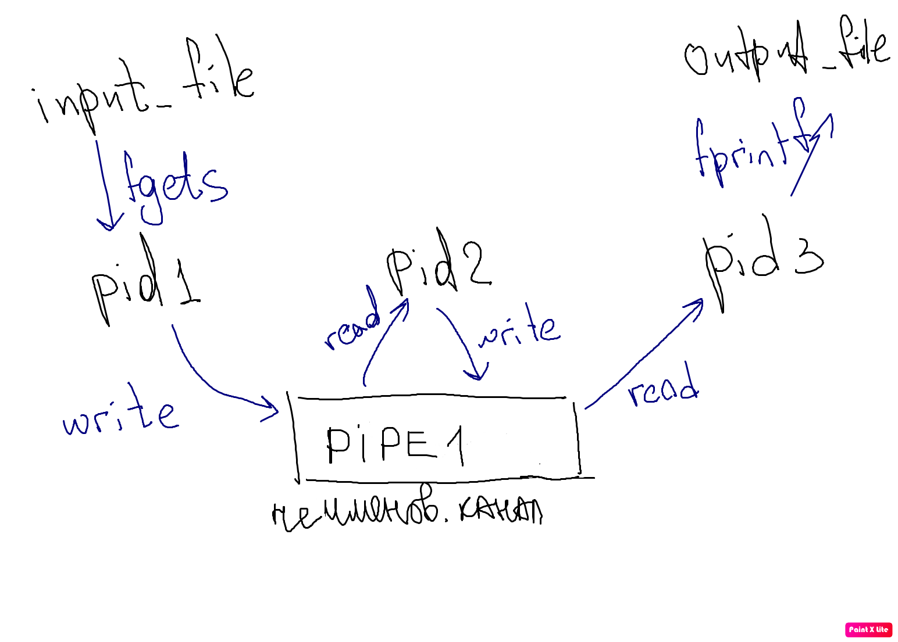
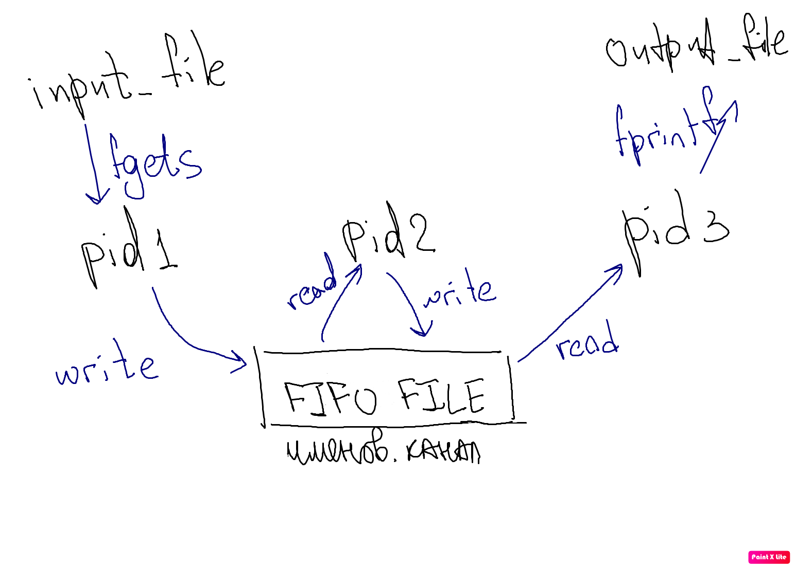
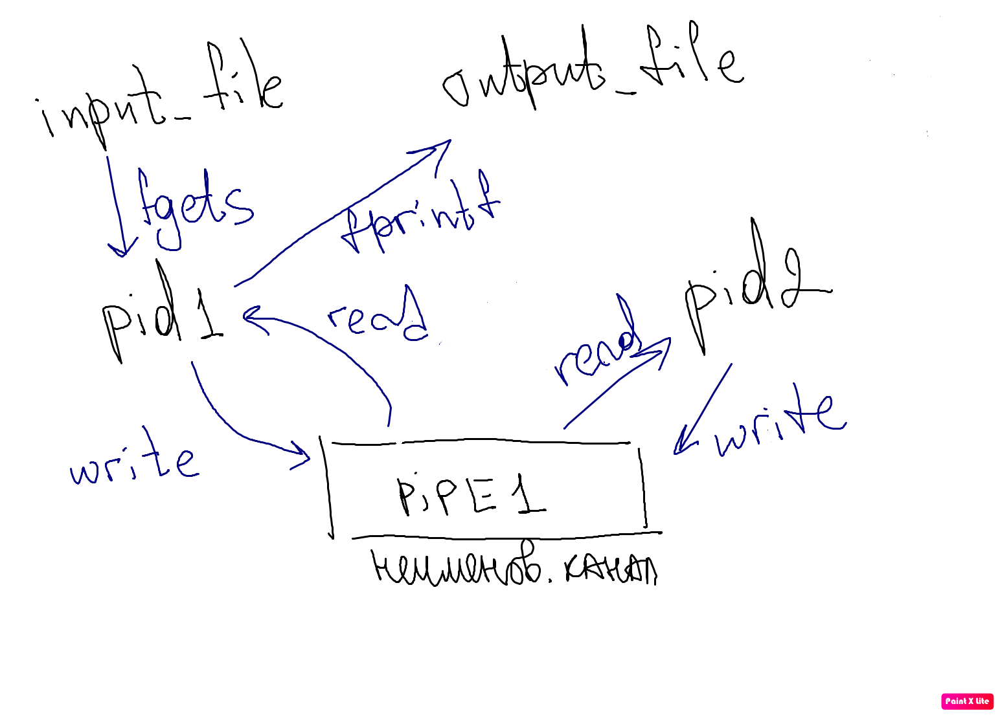
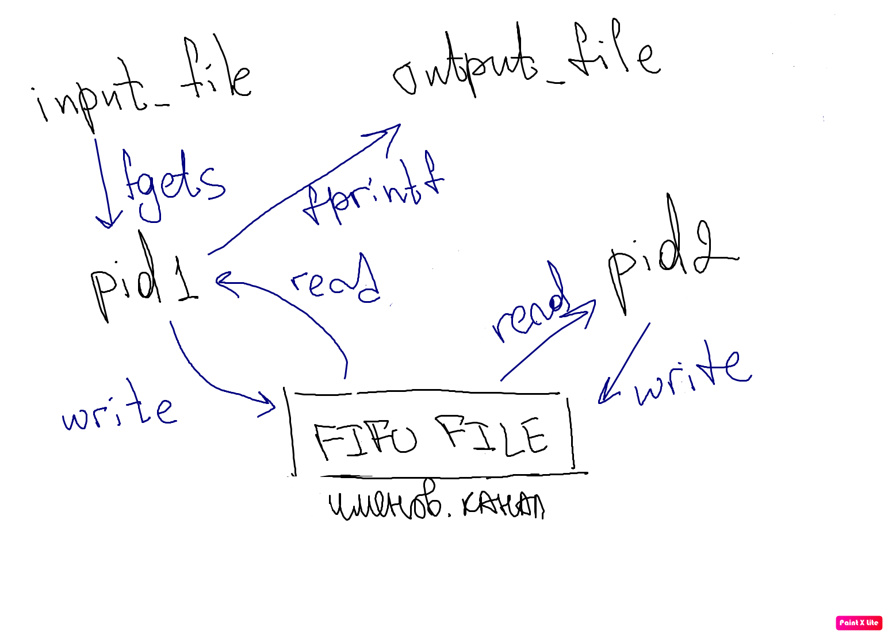

# ОС ИДЗ1 Габдуллина Алия БПИ214

Вариант 31: Разработать программу, которая ищет в ASCII-строке целые числа и формирует из них новую строку, в которой числа разделяются знаком «+». Числа состоят из цифр от 0 до 9. Все остальные символы являются разделителями разделителями чисел (включая и буквы).

Задание выполнено на 7 баллов

**Задание на 4:**

Есть три процесса: pid1, pid2 и pid3, которые взаимодействуют через неименованный канал pipe1. Взаимодействие процессов представлено на схеме: 




Первый дочерний процесс считывает исходные данные из input файла и передает их в канал. Второй дочерний процесс читает данные из канала и находит ответ на поставленную задачу (проходится по строке и выявляет все числа, записывая их в результирующую строку через знак “+”). Далее второй процесс передает ответ обратно в канал и третий дочерний процесс считывает его и выводит ответ в output файл. 

Код с комментариями:
```
c
#include <stdio.h>
#include <stdlib.h>
#include <unistd.h>
#include <ctype.h>
#include <string.h>

#define BUFFER_SIZE 5000     //размер буфера

int main(int argc, char **argv) {
    if (argc != 3) {
        perror("Wrong input data\n");
        return 1;
    }

    FILE *input_file = fopen(*(argv + 1), "r");
    FILE *output_file = fopen(*(argv + 2), "w");

    if (input_file == NULL || output_file == NULL) {     //проверка файлов
        perror("File opening error");
        return 1;
    }

    int pipe1[2];
    pid_t pid1, pid2, pid3;
    char buffer[BUFFER_SIZE];

    if (pipe(pipe1) < 0) {      // Создание неименованного канала и проверка
        perror("Pipe creation error");
        return 1;
    }

    pid1 = fork();  // Создание первого дочернего процесса

    if (pid1 == -1) {   //проверка первого дочернего процесса
        perror("Fork error");
        return 1;
    }

    if (pid1 == 0) { // Первый дочерний процесс
        close(pipe1[0]);
        char message[BUFFER_SIZE];
        fgets(message, BUFFER_SIZE, input_file);        //получение данных из файла
        write(pipe1[1], message, sizeof(message));  //запись данных в пайп
        // запись в канал
        close(pipe1[1]);
    } else {
        pid2 = fork();  // Создание второго дочернего процесса
        if (pid2 < 0) {
            perror("Fork error");
            return 1;
        }
        if (pid2 == 0) { //Второй дочерний процесс
            read(pipe1[0], buffer, sizeof(buffer));// чтение из канала
            close(pipe1[0]);
            char result[BUFFER_SIZE] = "";
            char num_str[BUFFER_SIZE] = "";
            int num;
            int len = strlen(buffer);
            int j, k = 0;

            for (int i = 0; i < len; i++) { //нахождение ответа на поставленную задачу
                if (isdigit(buffer[i])) {
                    num_str[j++] = buffer[i];
                } else {
                    if (j > 0) {
                        num_str[j] = '\0';
                        num = atoi(num_str);
                        if (k > 0) {
                            strcat(result, "+");
                        }
                        sprintf(num_str, "%d", num);
                        strcat(result, num_str);
                        j = 0;
                        k++;
                    }
                }
            }

            if (j > 0) {
                num_str[j] = '\0';
                num = atoi(num_str);
                if (k > 0) {
                    strcat(result, "+");
                }
                sprintf(num_str, "%d", num);
                strcat(result, num_str);
            }
            //
            char res[BUFFER_SIZE];
            sprintf(res, "%s", result);
            write(pipe1[1], res, sizeof(buffer));   //запись ответа в канал
            close(pipe1[1]);
        } else {
            pid3 = fork();  //создание третьего дочернего процесса
            if (pid3 == -1) {
                perror("Fork error");
                return 1;
            }
            if (pid3 == 0) {
                char output[BUFFER_SIZE];
                read(pipe1[0], output, sizeof(output)); //чтение ответа из канала
                fprintf(output_file, "%s", output);     //вывод ответа в файл
                close(pipe1[0]);
            }
        }
    }

    return 0;
}
```

**Задание на 5:**

Аналогично есть три процесса: pid1, pid2 и pid3. Только теперь они взаимодействуют через именованный канал FIFO_FILE. Взаимодействие процессов представлено на схеме: 



Первый дочерний процесс считывает исходные данные из input файла и передает их в канал. Второй дочерний процесс читает данные из канала и находит ответ на поставленную задачу (проходится по строке и выявляет все числа, записывая их в результирующую строку через знак “+”). Далее второй процесс передает ответ обратно в канал и третий дочерний процесс считывает его и выводит ответ в output файл. 

Код с комментариями:

```
c
#include <stdio.h>
#include <unistd.h>
#include <fcntl.h>
#include <sys/stat.h>
#include <string.h>
#include <ctype.h>
#include <stdlib.h>

#define FIFO_FILE "/tmp/myfifo" //расположение файла
#define BUFFER_SIZE 5000        //размер буфера

int main(int argc, char **argv) {
    if (argc != 3) {
        perror("Wrong input data\n");
        return 1;
    }

    FILE *input_file = fopen(*(argv + 1), "r");
    FILE *output_file = fopen(*(argv + 2), "w");

    if (input_file == NULL || output_file == NULL) {    //проверка файлов
        perror("File opening error");
        return 1;
    }

    int pipe1;
    pid_t pid1, pid2, pid3;
    char buffer[BUFFER_SIZE];
    mkfifo(FIFO_FILE, 0666);    // Создание именованного канала

    pid1 = fork();      // Создание первого дочернего процесса

    if (pid1 == -1) {   //Проверка первого дочернего процесса
        printf("Fork error");
        return 0;
    }

    if (pid1 == 0) { // Первый дочерний процесс:
        char message[BUFFER_SIZE];
        fgets(message, BUFFER_SIZE, input_file);    //получение данных из файла
        pipe1 = open(FIFO_FILE, O_WRONLY);
        if (pipe1 == -1) {
            printf("Error opening named pipe");
            return 0;
        }
        write(pipe1, message, sizeof(message)); //запись данных в канал
        close(pipe1);
    } else {
        pid2 = fork();  //создание второго дочернего процесса
        if (pid2 == -1) {   //проверка второго дочернего процесса
            printf("Fork error");
            return 0;
        }
        if (pid2 == 0) { // Второго дочерний процесс
            pipe1 = open(FIFO_FILE, O_RDONLY);
            if (pipe1 == -1) {
                printf("Error opening named pipe");
                return 0;
            }
            read(pipe1, buffer, sizeof(buffer));    //чтение данных из канала
            char result[BUFFER_SIZE] = "";
            char num_str[BUFFER_SIZE] = "";
            int num;
            int len = strlen(buffer);
            int j, k = 0;

            for (int i = 0; i < len; i++) {         //выполнение условия задачи
                if (isdigit(buffer[i])) {
                    num_str[j++] = buffer[i];
                } else {
                    if (j > 0) {
                        num_str[j] = '\0';
                        num = atoi(num_str);
                        if (k > 0) {
                            strcat(result, "+");
                        }
                        sprintf(num_str, "%d", num);
                        strcat(result, num_str);
                        j = 0;
                        k++;
                    }
                }
            }

            if (j > 0) {
                num_str[j] = '\0';
                num = atoi(num_str);
                if (k > 0) {
                    strcat(result, "+");
                }
                sprintf(num_str, "%d", num);
                strcat(result, num_str);
            }

            char res[BUFFER_SIZE];
            sprintf(res, "%s", result);
            close(pipe1);
            pipe1 = open(FIFO_FILE, O_WRONLY);
            write(pipe1, res, sizeof(res)); //запись ответа на задачу в пайп
            close(pipe1);
        } else {
            pid3 = fork();      //создание третьего дочернего процесса
            if (pid3 == -1) {   //проверка третьего дочернего процесса
                printf("Fork error");
                return 0;
            }
            if (pid3 == 0) {
                char output[BUFFER_SIZE];
                pipe1 = open(FIFO_FILE, O_RDONLY);
                if (pipe1 == -1) {
                    printf("Error opening named pipe");
                    return 0;
                }
                read(pipe1, output, sizeof(output));    //получение данных из канала
                fprintf(output_file, "%s", output);     //вывод данных в файл
                close(pipe1);
            }
        }
    }
    return 0;
}
```

**Задание на 6:**

Теперь есть два процесса: pid1 и pid2. Они взаимодействуют через неименованный канал pipe1. Взаимодействие процессов представлено на схеме: 



Первый дочерний процесс считывает исходные данные из input файла и передает их в канал. Второй дочерний процесс читает данные из канала и находит ответ на поставленную задачу (проходится по строке и выявляет все числа, записывая их в результирующую строку через знак “+”). Далее второй процесс передает ответ обратно в канал и первый дочерний процесс считывает его и выводит ответ в output файл. 

Код с комментариями:

```
c
#include <stdio.h>
#include <stdlib.h>
#include <unistd.h>
#include <ctype.h>
#include <string.h>

#define BUFFER_SIZE 5000    // размер буфера

int main(int argc, char **argv) {
    if (argc != 3) {
        perror("Wrong input data\n");
        return 1;
    }

    FILE *input_file = fopen(*(argv + 1), "r");
    FILE *output_file = fopen(*(argv + 2), "w");

    if (input_file == NULL || output_file == NULL) {
        perror("File opening error");
        return 1;
    }

    int pipe1[2];
    pid_t pid1, pid2;
    char buffer[BUFFER_SIZE];

    if (pipe(pipe1) < 0) {
        perror("Pipe creation error");
        return 1;
    }

    pid1 = fork();   // Создание первого дочернего процесса

    if (pid1 == -1) {
        perror("Fork error");
        return 1;
    }

    if (pid1 == 0) {
        close(pipe1[0]);
        char message[BUFFER_SIZE];
        fgets(message, BUFFER_SIZE, input_file);        //получение данных из айла
        write(pipe1[1], message, sizeof(message));  //запись данных в канал
        close(pipe1[1]);
    } else {
        pid2 = fork();   // Создание второго дочернего процесса
        if (pid2 < 0) {
            perror("Fork error");
            return 1;
        }
        if (pid2 == 0) {
            read(pipe1[0], buffer, sizeof(buffer)); // чтение данных из канала
            close(pipe1[0]);
            char result[BUFFER_SIZE] = "";
            char num_str[BUFFER_SIZE] = "";
            int num;
            int len = strlen(buffer);
            int j, k = 0;

            for (int i = 0; i < len; i++) { //нахождение ответа на задачу
                if (isdigit(buffer[i])) {
                    num_str[j++] = buffer[i];
                } else {
                    if (j > 0) {
                        num_str[j] = '\0';
                        num = atoi(num_str);
                        if (k > 0) {
                            strcat(result, "+");
                        }
                        sprintf(num_str, "%d", num);
                        strcat(result, num_str);
                        j = 0;
                        k++;
                    }
                }
            }

            if (j > 0) {
                num_str[j] = '\0';
                num = atoi(num_str);
                if (k > 0) {
                    strcat(result, "+");
                }
                sprintf(num_str, "%d", num);
                strcat(result, num_str);
            }

            char res[BUFFER_SIZE];
            sprintf(res, "%s", result);
            write(pipe1[1], res, sizeof(buffer));   //запись ответа в канал
            close(pipe1[1]);
        } else {
            pid1 = fork();
            if (pid1 == -1) {
                printf("Fork error");
                return 0;
            }
            if (pid1 == 0) {
                char output[5000];
                read(pipe1[0], output, sizeof(output)); //чтение ответа из пайпа
                fprintf(output_file, "%s", output); //запись ответа в файл
                close(pipe1[0]);
            }
        }
    }
    return 0;
}
```


**Задание на 7:**

Аналогично есть два процесса: pid1 и pid2. Они взаимодействуют через именованный канал FIFO_FILE. Взаимодействие процессов представлено на схеме: 



Первый дочерний процесс считывает исходные данные из input файла и передает их в канал. Второй дочерний процесс читает данные из канала и находит ответ на поставленную задачу (проходится по строке и выявляет все числа, записывая их в результирующую строку через знак “+”). Далее второй процесс передает ответ обратно в канал и первый дочерний процесс считывает его и выводит ответ в output файл. 

Код с комментариями:

```
c
#include <stdio.h>
#include <unistd.h>
#include <fcntl.h>
#include <sys/stat.h>
#include <string.h>
#include <ctype.h>
#include <stdlib.h>

#define FIFO_FILE "/tmp/myfifo"  //расположение файла
#define BUFFER_SIZE 5000        //размер буфера

int code7(int argc, char **argv) {
    if (argc != 3) {
        perror("Wrong input data\n");
        return 1;
    }

    FILE *input_file = fopen(*(argv + 1), "r");
    FILE *output_file = fopen(*(argv + 2), "w");

    if (input_file == NULL || output_file == NULL) {
        perror("File opening error");
        return 1;
    }

    int pipe1;
    pid_t pid1, pid2;
    char buffer[BUFFER_SIZE];
    mkfifo(FIFO_FILE, 0666); // Создание именованного канала

    pid1 = fork();  // Создание первого дочернего процесса

    if (pid1 == -1) {
        printf("Fork error");
        return 0;
    }

    if (pid1 == 0) {
        char message[BUFFER_SIZE];
        fgets(message, BUFFER_SIZE, input_file);   //получение данных из файла
        pipe1 = open(FIFO_FILE, O_WRONLY);
        if (pipe1 == -1) {
            printf("Error opening named pipe");
            return 0;
        }
        write(pipe1, message, sizeof(message));     //запись аднных в пайп
        close(pipe1);
    } else {
        pid2 = fork();          //создание второго дочернего процесса
        if (pid2 == -1) {
            printf("Fork error");
            return 0;
        }
        if (pid2 == 0) {
            pipe1 = open(FIFO_FILE, O_RDONLY);
            if (pipe1 == -1) {
                printf("Error opening named pipe");
                return 0;
            }
            read(pipe1, buffer, sizeof(buffer));    //чтение данных из пайпа
            char result[BUFFER_SIZE] = "";
            char num_str[BUFFER_SIZE] = "";
            int num;
            int len = strlen(buffer);
            int j, k = 0;

            for (int i = 0; i < len; i++) {     //вычисление ответа
                if (isdigit(buffer[i])) {
                    num_str[j++] = buffer[i];
                } else {
                    if (j > 0) {
                        num_str[j] = '\0';
                        num = atoi(num_str);
                        if (k > 0) {
                            strcat(result, "+");
                        }
                        sprintf(num_str, "%d", num);
                        strcat(result, num_str);
                        j = 0;
                        k++;
                    }
                }
            }

            if (j > 0) {
                num_str[j] = '\0';
                num = atoi(num_str);
                if (k > 0) {
                    strcat(result, "+");
                }
                sprintf(num_str, "%d", num);
                strcat(result, num_str);
            }
            char res[BUFFER_SIZE];
            sprintf(res, "%s", result);
            close(pipe1);
            pipe1 = open(FIFO_FILE, O_WRONLY);
            write(pipe1, res, sizeof(res)); //запись ответа в канал
            close(pipe1);
        } else {
            pid1 = fork();
            if (pid1 == -1) {
                printf("Fork error");
                return 0;
            }
            if (pid1 == 0) {
                char output[5000];
                pipe1 = open(FIFO_FILE, O_RDONLY);
                if (pipe1 == -1) {
                    printf("Error opening named pipe");
                    return 0;
                }
                read(pipe1, output, sizeof(output));   //чтение ответа из канала
                fprintf(output_file, "%s", output);     //вывод ответа в файл
                close(pipe1);
            }
        }
    }

    return 0;
}
```
